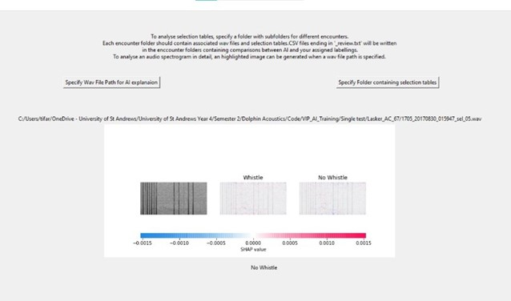

# Whistle-Classification-Quality-Assurance-GUI
This repository contains code implementing a simple graphical user interface (GUI) which biologists can use as an aid for quality assurance when selecting whistles. A user can have a machine learning model analyse wav files (specified by selection tables) to provide the user with a second opinion about their whistle selections. This repository is a combination of three separate projects:
- [CetaceXplain](https://github.com/dolphin-acoustics-vip/CetaceXplain/blob/main/README.md) (for specrogram explanations)
- [Generating-Datasets](https://github.com/dolphin-acoustics-vip/Generating-Datasets) (for generating normalised spectrograms)
- [SelectionTableReader](https://github.com/dolphin-acoustics-vip/SelectionTableReader) (for reading data from selection tables)

## Example Image of User Interface

# Setting up Virtual Environment/Conda Environment

## Using requirements.txt
It is very important that the Python library versions specified in the `requirements.txt` file be used as the code in this repository is not guaranteed to successfully generate a working Python executable for other cobinations of libarary dependencies. For this specific `requirements.txt`, the code has been tested to run with both conda and virtual environments. 

## Python Version
**The Python version used for this project was Python 3.8.7**. As all major testing was done with the version, there is not an absolute guarantee that it will work with others. The most up-to-date version of TensorFlow no longer supports this version of Python (see https://www.tensorflow.org/install/pip) so if upgrades are made to this library in future, this will fact will have to ve carefully considered. Newer versions of TensorFlow may be unable to run on older versions of TensoFlow and vice versa. As another general point, it should also be noted that Anaconda does not support all versions of Python (see https://docs.conda.io/projects/conda/en/23.1.x/user-guide/tasks/manage-python.html#:~:text=Anaconda%20supports%20Python%203.7%2C%203.8,current%20default%20is%20Python%203.9.). The alllowed Python versions in a conda environment is something to consider early on before delving into installing all packages.

## Bugs

### Bug associated with TensorFlow and PyInstaller
There appears to be a pernicious issue with a warning generated by TensorFlow which allows the code to run fine if simply executing the Python script but which crashes the compiled executable file generated by PyInstaller if run as an app. See the discussion of Issue https://github.com/dolphin-acoustics-vip/Whistle-Classification-Quality-Assurance-GUI/issues/1 for more information.

### Unkown Bug Causing Crashes
See Issue https://github.com/dolphin-acoustics-vip/Whistle-Classification-Quality-Assurance-GUI/issues/2 for a discussion on this.

# Running PyInstaller 
After all the virtual/conda envrionment is set up and all the relevant code is written, PyInstaller can be used as follows to generate a standalone executable with no background cmd window:

`pyinstaller --onefile --windowed DolphinGUI.py`

For debugging purposes, running without the `windowed` keyword and instead using 

`pyinstaller --onefile --debug all DolphinGUI.py`

can be helpful. In this case, the error messages can be read off of the command line from which the executable is run.

